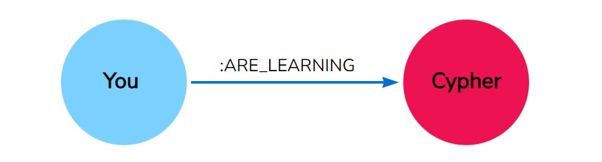
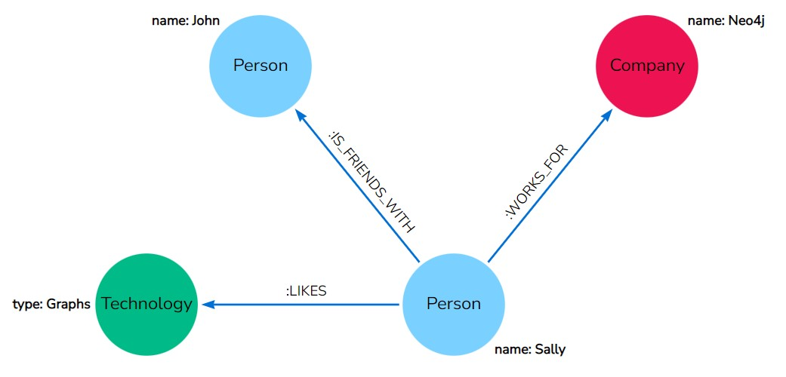
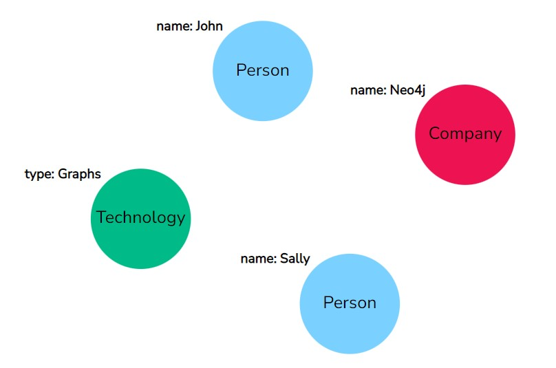
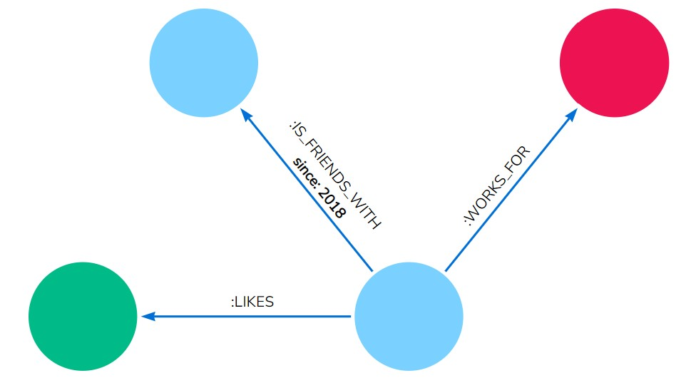

<h1 dir="rtl" align = "center"> Neo4j  </h1>

<h1 dir="rtl">
مقدمه:</h1>

در عصری که در آن به سر می‌بریم، کلان داده (Big Data) بخش قابل‌توجهی از دارایی‌های کسب‌ و کارها را تشکیل داده است، اما باید توجه داشته باشیم که هَندل کردن این حجم زیاد از داده‌ها نیاز به زیرساخت‌های مناسبی دارد و پایگاه داده هایی که در گذشته معمول بوده‌اند دیگر پاسخگوی نیاز این دست کسب‌وکارها نخواهند بود که در همین راستا پایگاه داده ای تحت عنوان Neo4j طراحی و توسعه داده شده که جزو دیتابیس‌های مبتنی بر گراف محسوب می‌شود.

درواقع، امروزه داده‌های مختلف دیگر نقشی کلیدی در معادلات دنیای فناوری ندارند بلکه ارتباط مابین این داده‌ها است که نقش کلیدی را بازی می‌کند. در عصر فناوری اطلاعات، بیگ دیتا نقشی کلیدی در درآمدزایی کسب‌وکارهای مختلف دارد اما شرکت‌های پیشرو نیازی به چیزی بیش از داده‌های کلان دارند؛ به عبارتی، نیاز به درک ارتباط مابین دیتاهای مختلف دارند و اینجا است که دیتابیس‌های گرافی وارد صحنه می‌شوند.

Neo4j  در سال 2000 توسعه یافت به طوری که پس از ده سال نسخهٔ اول آن به بازار عرضه شد و با توجه به ماهیت اپن‌سورس بودن‌اش، در این سال‌ها به عنوان معروف‌ترین دیتابیس گرافی دنیا قلمداد می‌شود.  با استفاده از Neo4j دیگر مجبور به استفاده از جداول از پیش تعریف شده برای ذخیره‌سازی داده‌ها نبوده و هر زمانی که اپلیکیشن شما نیاز به تغییر داشته باشد، ظرف مدت چند دقیقه می‌توان تغییرات مد نظر را اِعمال کرد. وقتی هم که بحث کوئری زدن به دیتابیس به میان برسد، Neo4j در مقایسه با روش‌های سنتی مثل MySQL، خیلی سریع می‌تواند دیتای مورد نیاز را در اختیار اپلیکیشن قرار دهد.

<h1 dir="rtl">
پایگاه داده ای گراف
</h1>

گراف نمایش مجموعه ای از objectها به صورت تصویر است که در آن برخی از جفت object ها توسط linkبه هم متصل می شوند. این نوع پایگاه داده از دو عنصر nodeها (رئوس) و relationshipها (ارتباطات) تشکیل شده است. پایگاه داده گراف پایگاه داده ای است که از آن برای مدل سازی داده ها به صورت گراف استفاده می شود. nodeهای نمودار، موجودیت ها و relationshipها ارتباط این node ها را نشان می دهد.

Cypher یک زبان پرس و جوی قدرتمند، بصری و بهینه شده با نمودار است که اتصالات داده ها را درک می کند. user-friendly هست یادگیری آن آسان است و ارتباطات را - در هر جهت - دنبال می کند تا روابط و خوشه های ناشناخته قبلی را آشکار کند.

<h1 dir="rtl">
 انواع پایگاه داده های معروف از نوع گراف
</h1>

پایگاه داده Neo4j یک پایگاه داده معروف از نوع گراف است. پایگاه داده های GraphBase، HypherGraphDB، Orient DB، Oracle NoSQL Database، InfiniteGraph  و AllegroGraph از جمله نمونه های دیگر این نوع پایگاه داده ها هستند.

<h1 dir="rtl">
فواید پایگاه داده گراف
</h1>

از آنجایی که بیشتر داده ها به صورت روابط بین object های متفاوت هستند و بیشتر مواقع رابطه بین داده ها نسبت به خود داده ارزش بیشتری دارد. پایگاه داده های رابطه ای داده های highly structured را ذخیره می کنند که در آن ها چندین record، یک نوع داده یکسان را ذخیره می کنند، بنابراین می توانند برای ذخیره داده های structured استفاده شوند و روابط بین داده ها را ذخیره نمی کنند. برخلاف سایر پایگاه داده ها، پایگاه داده‌های گراف روابط و اتصالات را به‌عنوان موجودیت‌های First-class ذخیره می‌کنند. Data model برای پایگاه داده‌های Graph در مقایسه با سایر پایگاه داده‌ها ساده‌تر است و می‌توان آن‌ها را با سیستم‌های OLTP استفاده کرد و ویژگی‌هایی مانند یکپارچگی Transactional و Operational availability را نیز ارائه می‌دهند

<h1 dir="rtl">
Neo4j چیست
</h1>

Neo4j یکی از معروف ترین سیستم مدیریت دیتابیس است که از خانواده دیتابیس های NoSQL به شمار می رود. Neo4j با Mysql و یا MongoDB متفاوت است و دارای ویژگی های خاص خود است که این ویژگی ها آن را در مقایسه با سایر سیستم های مدیریت دیتابیس خاص می کند.

<h1 dir="rtl">
ساختار پایگاه داده Neo4j
</h1>

دیتابیس Neo4j داده‌ها را به صورت نمودار ذخیره و ارائه می‌کند و نه به ‌صورت جدول یا JSON. در دیتابیس Neo4j کل داده‌ها توسط  nodeها نمایش داده می‌شوند و شما می‌توانید رابطه‌ای بین nodeها ایجاد کنید. این بدان معناست که کل مجموعه دیتابیس مانند یک نمودار خواهد بود، به همین دلیل آن را از دیگر سیستم‌های مدیریت دیتابیس منحصربه‌فرد می‌کند.
MS Access، SQL server و تمام دیتابیس های رابطه ای از table، columns و row برای ذخیره داده ها استفاده می کنند اما Neo4j از این موارد استفاده نمی کند.

<h1 dir="rtl">
ویژگی های Neo4j
</h1>

در زیر ویژگی‌های قابل‌توجه Neo4j آورده شده است:

<h3 dir="rtl">Data model (Flexible schema)</h3>

Neo4j از Data model ای به نام Native property graph model پیروی می‌کند. یک Graph شامل یکسری Node ها (Entity ها یا موجودیت‌ها) است که این Node ها با یکدیگر متصل می‌شوند (توسط Relationship ها به تصویر کشیده می‌شوند). Node ها و Relationship ها، داده‌ها را در جفت key-value که به‌عنوان Property شناخته می‌شوند ذخیره می‌کنند. در Neo4j نیازی به پیروی از یک Schema ثابت نیست و طبق نیازتان می‌توانید خصوصیات را اضافه یا حذف کنید. همچنین می‌توانید محدودیت‌هایی برای Schema ایجاد کنید.

<h3 dir="rtl">خواص ACID</h3>

Neo4j از قوانین کامل ACID (Atomicity، Consistency، Isolation و Durability) پشتیبانی می‌کند.

<h3 dir="rtl">Scalability و Reliability</h3>

می‌توانید با افزایش تعدادRead/Write ها و Volume، بدون تأثیر بر سرعت پردازشQuery و یکپارچگی داده‌ها، پایگاه داده را بزرگ کنید. Neo4j همچنین ازReplication برایSafety وReliability داده‌ها پشتیبانی می‌کند

<h3 dir="rtl">Cypher Query Language</h3>

Neo4j یک‌زبان Declarative query قدرتمند ارائه می‌دهد که به Cypher معروف است و در آن برای به تصویر کشیدن Graph ها از ASCII استفاده می‌شود. Cypher به‌راحتی قابل یادگیری است و می‌تواند بدون استفاده از Query های پیچیده مانند Join، برای ایجاد و Retrieve روابط بین داده‌ها مورداستفاده قرار گیرد.

<h3 dir="rtl">برنامه‌ی  Built-in web</h3>

Neo4j  یک برنامه وب مرورگر Built-in را ارائه می‌دهد که با استفاده از آن، می‌توانید داده‌های Graph خود را ایجاد کرده و برای آن ها Query بنویسید.

<h3 dir="rtl">Drivers</h3>

Neo4j می‌تواند با موارد زیر کار کند:
Neo4j می‌تواند با REST API (برای کار با زبان‌های برنامه‌نویسی مانند Java، Spring، Scala و غیره)، جاوا اسکریپت (برای کار با Framework های UI MVC مانند Node JS ) کار کند و از دو نوع Java API نیز پشتیبانی می‌کند: Cypher API و Native Java API برای توسعه برنامه‌های جاوا. علاوه بر این، می‌توانید با پایگاه داده‌های دیگری مانند MongoDB، Cassandra و غیره نیز کار کنید.

<h3 dir="rtl">Indexing</h3>

Neo4j با استفاده از Apache License از Index ها پشتیبانی می‌کند.

<h1 dir="rtl">
نحوه استفاده از پایگاه داده Neo4j
</h1>

این پایگاه داده برای زمانی که تعداد روابط زیاد است، بهترین انتخاب است. همچنین برای ذخیره داده هایی که دارای چند اتصال بین nodeها هستند، توصیه می شود. پایگاه داده Neo4j از داده های رابطه ای راحتتر از دیتابیس های رابطه ای (relational databases) استفاده می کند زیرا نیازی به یک ساختار مشخص تعریف شده برای ذخیره داده ها ندارد. تنها نیاز است که داده ها را در Neo4j بارگذاری کرده و خود داده ها ساختار اصلی را تشکیل می دهد. درواقع این سیستم مدیریت دیتابیس، دارای schema اختیاری است. این پایگاه داده نیازی به Primary key و Foreign key ندارد و می تووان هر ارتباطی بین هر node مورد نظر خود را اضافه کنید. این قابلیت، Neo4j را برای داده های شبکه ای (Network) بسیار مناسب می کند.

<h1 dir="rtl">مزایای Neo4j</h1>

این مدل پایگاه داده مزایای زیادی دارد که در ادامه به بررسی برخی از آن‌ها پرداخته‌شده است:

<h3 dir="rtl"> Flexibility – Neo4: </h3>

یک Data model انعطاف‌پذیر ساده و درعین‌حال قدرتمند ارائه می‌دهد که با توجه به کاربردها به‌راحتی قابل‌تغییر است.

<h3 dir="rtl"> Real-time insight – Neo4j: </h3>

نتایج را بر اساس داده‌های Real-time ارائه می‌دهد.

<h3 dir="rtl"></h3>

<h3 dir="rtl">Availability بالا – Neo4j: </h3>

برای برنامه‌های بزرگ Real-time، بسیار Available است.

<h3 dir="rtl">داده‌های Semi structure و متصل:</h3>

 با استفاده از Neo4j می‌توانید به‌راحتی داده‌های متصل و Semi structure را نشان دهید.

<h3 dir="rtl"> Retrieval آسان: </h3>

با استفاده از Neo4j، نه‌تنها می‌توانید داده‌های متصل را در مقایسه با پایگاه داده‌های دیگر سریع‌تر نمایشن دهید، بلکه به‌راحتی نیز می‌توانید آن‌ها را Retrieval (Traverse/Navigate) کنید.

<h3 dir="rtl"> زبان Cypher query – Neo4j: </h3>

با استفاده از Ascii-art syntax، یک‌زبان Declarative query ارائه می‌دهد تا نمودار را به‌صورت Graph نشان دهد. دستورات این زبان توسط انسان قابل‌خواندن و یادگیری آن بسیار آسان است.

<h3 dir="rtl"> بدون Join:</h3>

 با استفاده از Neo4j، برای Retrieval داده‌های Connected/Related، نیازی به Join های پیچیده نیست زیرا بازیابی Node مجاور یا جزئیات رابطه‌ی آن بدون استفاده از Join ها یا Index ها بسیار آسان است.

<h1 dir="rtl">
زبان کوئری Cypher
</h1>

Cypher زبان جست و جوی گراف Neo4j است که به شما امکان می دهد داده ها را از نمودار بازیابی کنید (انگار مانند SQL برای گراف هاست! و از آنجایی که از SQL هم الهام گرفته شده است، به شما اجازه می دهد روی داده هایی که از گراف می خواهید تمرکز کنید و نگران چگونگی دریافت آن نباشید). این زبان به دلیل شباهت به زبان های دیگر و شهودی بودن آن، آسان ترین زبان گراف برای یادگیری است.
Cypher منحصر به فرد است زیرا روشی بصری برای تطبیق الگوها (patterns)  و روابط (relationships) ارائه می دهد. Cypher از سینتکس ASCII-art استفاده می کند به طوری که:

<code>
(nodes)-[:ARE_CONNECTED_TO]->(otherNodes)
</code>

که () برای گره ها (nodeها) و -[:ARROWS]-> برای روابط است.

در واقع زمانی که یک کوئری می نویسید، یک الگوی گرافی (graph pattern) را از طریق داده های خود ترسیم می کنید. کاربران Neo4j از Cypher برای ساخت کوئری های گویا و کارآمد استفاده میکنند تا بتوانند هر گونه عملیات create، read، update یا delete (CRUD) را روی گراف خود انجام دهند. Cypher رابط اصلی (primary interface) Neo4j است.

<h1 dir="rtl">
چرا Cypher
</h1>

همانطور که پیشتر اشاره کردیم، Neo4j یک مدل گراف ویژگی (property graph model)  است و از گره ها و روابطی تشکیل شده است که آنها هم ممکن است ویژگی هایی به همراه داشته باشند، با این حال، گره ها و روابط اجزای ساده ای هستند که با ارزش ترین و قوی ترین قطعه مدل گراف ویژگی که همان الگو یا همان (pattern) را می سازند. الگوها از عناصر گره و رابطه تشکیل شده اند و می توانند پیمایش ها و مسیرهای ساده یا پیچیده را توصیف کنند.

<h1 dir="rtl">
سینتکس Cypher
</h1>

ساختارهای Cypher، بر اساس نثر انگلیسی و شمایل نگاری منظم، کوئری را هم برای نوشتن و هم برای خواندن آسان می کند. به عنوان مثال، به داده های نمودار ساده در تصویر زیر نگاه کنید. چگونه این داده ها را به زبان انگلیسی نشان می دهید؟
در واقع می توان نوشت:

Sally likes Graphs. Sally is friends with John. Sally works for Neo4j.

سینتکس Cypher بر اساس ساختار زبان انگلیسی است که ایجاد کردیم. در ادامه نشان می دهیم که چگونه مثال بالا را می توان به Cypher نوشت.

<h1 dir="rtl">
گره ها در Cypher
</h1>

 از آنجایی که Cypher برای الگوها  از ASCII-Art الهام گرفته شده است،  از آنجایی که می دانیم که اجزای اصلی مدل گراف ویژگی گره ها و روابط هستند به یک روش بصری برای نمایش هر جز از الگوی خود در بالا نیاز داریم. باید به یاد داشته باشیم که گره ها موجودیت های داده در گراف شما هستند و اغلب می توانید گره ها را با یافتن اسم ها یا اشیا در مدل داده خود شناسایی کنید. در مثالی که گفته شد، Sally، Graphs، John و Neo4j گره های ما هستند.

برای نشان دادن گره ها در Cypher، اطراف گره را با پرانتز احاطه می کنیم، مثلا (node). توجه کنید که چگونه پرانتزها شبیه دایره هایی هستند که نمایش بصری برای گره ها در مدل داده ما استفاده می کند.

به طور کلی نیز مثلا برای نشان دادن شی Person میتوان از (P) یا برای نشان دادن شی Thing از (T) استفاده کرد و به طور کلی هم () نشان دهنده گره ناشناس (anonymous node) است که با پرانتز خالی نشان داده می شود.
مدل داده های گراف ویژگی را در نظر داشته باشید، می توان با اختصاص یک برچسب گره (node label)، گره های مشابه را با هم گروه بندی کنید. برچسب ها به نوعی مانند tag ها هستند و به شما این امکان را می دهند که انواع خاصی از موجودیت ها را برای جست و جو یا ایجاد مشخص کنید. در مثال ما، Person، Technology و Company برچسب ها هستند.

<h1 dir="rtl">
روابط در Cypher
</h1>

برای استفاده کامل از قدرت یک پایگاه داده گراف، باید روابط بین گره های خود را نیز بیان کنیم. روابط در Cypher با استفاده از یک فلش --> یا <--  نشان داده می شوند. درواقع شاید متوجه شده باشید که سینتکس چگونه شبیه فلش ها و خطوطی است که گره های ما را در نمایش بصری به هم متصل می کند. اطلاعات اضافی، مانند نحوه اتصال گره ها (نوع رابطه) و هر ویژگی مربوط به رابطه را می توان در براکت های مربعی داخل فلش قرار داد. در مثال ما خط هایی که دارای LIKES، IS_FRIENDS_WITH و WORKS_FOR که بین گره ها هستند روابط ما هستند.

روابط غیر جهت دار بدون پیکان و فقط با دو خط تیره -- نشان داده می شوند و بدان معنی است که رابطه را در هر جهت طی کرد. باید توجه داشت که زمانی که یک جهت (direction) باید در پایگاه درج شود، می توان آن را با یک رابطه غیر جهت دار مطابقت داد به طوری که در آن Cypher هر جهت مشخصی را نادیده گرفته و رابطه و گره های متصل را بدون توجه به جهت فیزیکی بازیابی می کند. این کار اجازه می دهد تا کوئری ها انعطاف پذیر باشند و کاربر را مچبور به دانستن جهت فیزیکی رابطه ذخیره شده در پایگاه داده نمی کند.

اگر داده ها با یک جهت رابطه ذخیره شوند و یک کوئری جهت اشتباه را مشخص کند، Cypher هیچ نتیجه ای برنخواهد گرداند. در این موارد که ممکن است از جهت گیری مطمئن نباشید، بهتر است از یک رابطه غیر جهت دار استفاده کنید و برخی از نتایج را بازیابی کنید.

<code>

//data stored with this direction
CREATE (p:Person)-[:LIKES]->(t:Technology)
 
//query relationship backwards will not return results
MATCH (p:Person)<-[:LIKES]-(t:Technology)
 
//better to query with undirected relationship unless sure of direction
MATCH (p:Person)-[:LIKES]-(t:Technology)

</code>

<h1 dir="rtl">
 ویژگی های گره یا روابط
</h1>

ما در مورد نحوه نوشتن Cypher برای گره ها، روابط و برچسب ها صحبت کرده ایم. آخرین موردی که از مدل داده گراف باقی میماند ویژگی ها (property) هستند. باید به یاد داشته باشید که ویژگی ها جفت هایی به صورت name-value هستند که جزئیات بیشتری را به گره ها و روابط ما ارائه می دهند.

برای نمایش این موارد در Cypher، می توانیم از {} در داخل پرانتز یک گره یا براکت‌های یک رابطه استفاده کنیم. سپس name و value داخل {} قرار می گیرد. گراف مثال ما هم یک ویژگی گره (name) و یک ویژگی رابطه (since) دارد.

ویژگی گره <code>
(p:Person {name: 'Sally'})
</code>

 ویژگی رابطه <code>
-[rel:IS_FRIENDS_WITH {since: 2018}]->
</code>

گره ها و روابط پایه های سازنده الگوهای گراف را تشکیل می دهند. این بلوک ها می توانند برای بیان الگوهای ساده یا پیچیده کنار هم قرار گیرند. الگوها قدرتمندترین قابلیت گراف ها هستند. در Cypher می توان آنها را به صورت یک مسیر پیوسته نوشت یا به الگوهای کوچکتر جدا کرد و با کاما به همدیگر وصل کرد.

برای نشان دادن یک الگو در Cypher، باید گره ها و سینتکس های رابطه ای را که تاکنون یاد گرفته اید، ترکیب کنید. بیایید از مثال استفاده کنیم: Sally likes Graphs

در Cypher این الگو مانند کد زیر به نظر خواهد رسید:

<code>
(p:Person {name: "Sally"})-[rel:LIKES]->(g:Technology {type: "Graphs"})
</code>

کد بالا الگوی مورد نظر ما را نشان می دهد اما نمی گوید که آیا می خواهیم آن الگوی موجود را پیدا کنیم یا آن را به عنوان یک الگوی جدید درج کنیم. برای اینکه به Cypher بگوییم که میخواهیم با الگو چه کاری انجام دهد، باید از چند keyword اضافه استفاده کنیم.

<h1 dir="rtl">
نتیجه گیری
</h1>

به طور کلی، در رابطه با Neo4j و زبان Cypher صحبت کردیم و در کل با آمدن این نوع جدید دیتابیس، مشکلات مربوط به big data تا حدود بسیار خوبی حل شد.

<h1 dir="rtl">
مراجع:</h1>

[https://neo4j.com/docs/getting-started/current/cypher-intro/](https://neo4j.com/docs/getting-started/current/cypher-intro/)

[https://sokanacademy.com/blog/neo4j](https://sokanacademy.com/blog/neo4j-%D8%AF%DB%8C%D8%AA%D8%A7%D8%A8%DB%8C%D8%B3-%DA%AF%D8%B1%D8%A7%D9%81%DB%8C-%D8%A8%D8%B1%D8%A7%DB%8C-%DA%A9%D8%A7%D8%B1-%D8%A8%D8%A7-%D8%A8%DB%8C%DA%AF-%D8%AF%DB%8C%D8%AA%D8%A7)

[https://mirbozorgi.com/what-is-neo4j/](https://mirbozorgi.com/what-is-neo4j/)

[https://liara.ir/blog/neo4j](https://liara.ir/blog/neo4j-%DA%86%DB%8C%D8%B3%D8%AA%D8%9F/)

نویسندگان:

میکائیل قربانی

رویا قوامی

محمدعلی حسین نژاد

